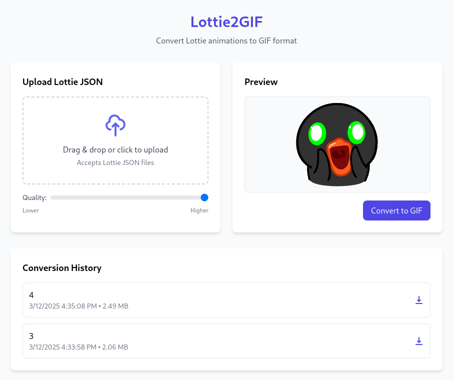

# Lottie2GIF Converter

A free, browser-based tool that converts Lottie JSON animations to GIF format without requiring any uploads to external servers. All processing happens directly in your browser, ensuring your animations remain private and secure.

## Features

- **Client-side Processing**: All conversions happen in your browser - no server uploads required
- **High-Quality Conversion**: Adjustable quality settings for the perfect balance of image quality and file size
- **Easy to Use**: Simple drag-and-drop interface with instant preview
- **Conversion History**: Keep track of your previous conversions for easy access
- **Free and Open Source**: No payment, no registration, no limits

## How It Works

1. **Upload** your Lottie JSON file via drag & drop or file picker
2. **Preview** your animation directly in the browser
3. **Adjust** quality settings to your preference
4. **Convert** to GIF with a single click
5. **Download** your newly created GIF

## Privacy

Lottie2GIF takes your privacy seriously. Since all processing happens directly in your browser:

- Your files never leave your device
- No data is sent to any servers
- No tracking or analytics are used

## Technical Details

Lottie2GIF is built with:

- HTML5, CSS, and JavaScript
- Lottie-web for animation rendering
- gif.js for GIF encoding
- TailwindCSS for styling

## Browser Support

Lottie2GIF works on all modern browsers:

- Chrome/Edge (latest versions)
- Firefox (latest versions)
- Safari (latest versions)
- Opera (latest versions)

---

Made with ❤️ by @lilas-dev
